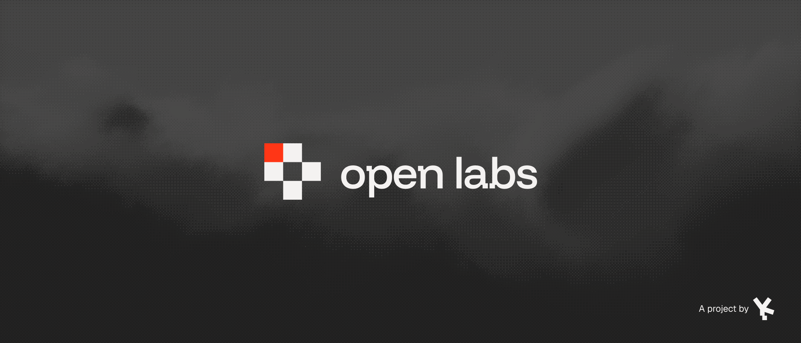
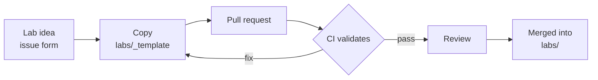

<p align="center">
  
</p>

<p align="center">
  <a href="LICENSE"></a>
  <a href="LICENSE-CONTENT"></a>
  <a href="https://github.com/Duckurity/openlabs/actions/workflows/labs.yml"></a>
</p>

## What openlabs is

Each lab is a self-contained security exercise: one vulnerable service, one
brief, one flag inside. Labs run on your machine with Docker Compose. You
solve at your own pace and verify every solve locally.

The repository is the lab library. Anything that helps you solve harder
problems on your own belongs here: clean briefs, reproducible environments,
and honest difficulty grades.

## Requirements

- Docker with Compose v2
- `python3` for the flag checker

## Solve a lab

1. Clone the repository and enter a lab:[^1]

   ```bash
   git clone https://github.com/Duckurity/openlabs
   cd openlabs/labs/web/duck-cross
   docker compose up -d
   ```

2. Open the service in your browser and work it until the flag turns up.
   The brief under each lab directory states the setup and the goal.

3. Check the solve:

   ```bash
   python3 scripts/check.py labs/web/duck-cross
   ```

   The checker hashes your input with SHA-256 and compares it against
   `flag_hash` in `lab.yml`. It prints `solved` or `not solved`.

## Tracks

| Track | Focus |
|---|---|
| `web` | injection, broken access control, auth bypass, SSRF |
| `binary` | memory corruption, exploitation, reverse engineering |
| `crypto` | weak primitives, protocol misuse, implementation faults |
| `network` | protocol abuse, traffic analysis, pivoting |
| `osint` | recon, source analysis, signature tracing |

## Difficulty

`easy` → `medium` → `hard` → `insane`

| Level | Expectation |
|---|---|
| `EASY` | one vector, minimal recon |
| `MEDIUM` | chained steps, some enumeration |
| `HARD` | multiple systems, custom tooling |
| `INSANE` | research-level, an original technique |

## Labs <sub>1 live</sub>

| Lab | Track | Difficulty | Description |
|---|---|---|---|
| [`duck-cross`](labs/web/duck-cross) | web | easy | a reports portal with a missing object-level authorization check |

## Flag format

<picture><source media="(prefers-color-scheme: dark)" srcset=".github/assets/mark-cross.svg"></picture> Every flag carries the mark: `duck{...}`. Lowercase letters, digits, and underscores between the braces, 16 to 40 characters.[^2]

The plaintext flag lives inside the lab; the repository stores only its
SHA-256 hash. Reading lab source to find the flag is a legitimate solve.
Open labs work that way.

## Anatomy of a lab

```
labs/<track>/<lab>/
├── lab.yml              # name, track, difficulty, description, flag_hash
├── README.md            # player brief: story, setup, goal
├── docker-compose.yml   # service definition
├── Dockerfile           # pinned base image
└── app/                 # lab internals; the flag lives here
```

`labs/_template/` carries the skeleton. Copy it, fill it in, and open a
pull request. CI validates structure, metadata, and flag hygiene on every
change.

## Writeups

A writeup is your own explanation of a solve. Publish them anywhere. Link
the lab so other people can follow the path you took.

## Licensing

Two licenses, one repository:

| Scope | License |
|---|---|
| Code, configuration, scripts | [Apache-2.0](LICENSE) |
| Lab briefs, docs, prose | [CC-BY-4.0](LICENSE-CONTENT) |

## Contributing

Labs are welcome. Read [CONTRIBUTING.md](CONTRIBUTING.md) before you open a
pull request. For behavior standards, see
[CODE_OF_CONDUCT.md](CODE_OF_CONDUCT.md).

<details>
<summary><samp>How a lab ships</samp></summary>



</details>

## Security

The vulnerabilities inside labs are the product; they need no report.
Weaknesses in lab infrastructure, repo tooling, or CI go through
[GitHub Private Vulnerability Reporting](https://github.com/Duckurity/openlabs/security/advisories/new).
Details in [SECURITY.md](SECURITY.md).

---

<p align="center">
  <a href="https://github.com/Duckurity">
    <picture>
      <source media="(prefers-color-scheme: dark)" srcset=".github/assets/powered-by.svg">
      
    </picture>
  </a>
</p>

[^1]: If port `8080` is taken on your machine, edit the host side of the
mapping in `docker-compose.yml`. The container port stays `8080`.

[^2]: `flag_hash` is the SHA-256 of the full flag string, braces included:
`printf '%s' 'duck{...}' | sha256sum`. Plaintext flags live only inside lab
internals.
