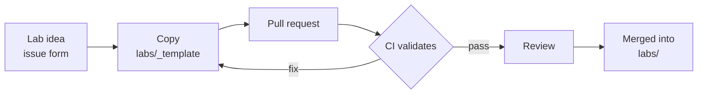

<p align="center">
  
</p>

<p align="center">
  Open-source cybersecurity labs that run in Docker. Exploit a real service,
  find the flag, verify the solve. No accounts, no scoring server.
  A <a href="https://github.com/Duckurity">duckurity</a> project.
</p>

<p align="center">
  <a href="LICENSE"><picture><source media="(prefers-color-scheme: dark)" srcset=".github/assets/badges/code-license-dark.svg?v=6164d6e0"></picture></a>
  <a href="LICENSE-CONTENT"><picture><source media="(prefers-color-scheme: dark)" srcset=".github/assets/badges/content-license-dark.svg?v=b83304a6"></picture></a>
  <!-- catalog-public:badges-start -->
  <picture><source media="(prefers-color-scheme: dark)" srcset=".github/assets/badges/labs-supported-dark.svg?v=5fbde818"></picture>
  <picture><source media="(prefers-color-scheme: dark)" srcset=".github/assets/badges/labs-experimental-dark.svg?v=01e16b65"></picture>
<!-- catalog-public:badges-end -->
  <picture><source media="(prefers-color-scheme: dark)" srcset=".github/assets/badges/docker-dark.svg?v=2b6c885f"></picture>
  <picture><source media="(prefers-color-scheme: dark)" srcset=".github/assets/badges/checker-dark.svg?v=cff908fc"></picture>
</p>

<p align="center">
  <a href="#get-solving">Quick start</a> · <a href="#labs-catalog">Labs</a> · <a href="https://github.com/Duckurity/openlabs/wiki">Wiki</a> · <a href="#contribute">Contribute</a>
</p>

## Listen

Press play to hear the welcome.

<audio controls src=".github/assets/audio/welcome.mp3?v=aa066c70">
  Your browser does not support the audio element.
</audio>

## Get solving

Three things stand between you and your first flag.

```bash
git clone https://github.com/Duckurity/openlabs
cd openlabs/labs/web/duck-cross
docker compose up -d
```

Open `http://localhost:8377`, work the brief until the flag turns up, then
check the solve:

```bash
python3 scripts/check.py labs/web/duck-cross
```

The checker hashes your input with SHA-256 and compares it against
`flag_hash` in `lab.yml`. It prints `solved` or `not solved`.[^1]

> [!TIP]
> After images are pulled, nothing leaves your machine. Labs are
> self-contained and fully offline.

Every lab is a self-contained exercise: one vulnerable service, one brief,
one flag inside. You solve at your own pace, and honesty is built in. The
repository stores only the SHA-256 hash of each flag, never the plaintext.

## What makes a lab

<div align="center">

| | |
|:---|:---|
| **Self-contained** | Runs offline once images are pulled. No phone-home. |
| **Reproducible** | Pinned base images, one documented host port. |
| **Honest** | Plaintext flags stay inside lab internals; only the hash ships. |
| **Graded** | A four-step difficulty ladder from `easy` to `insane`. |

</div>

## Tracks

<div align="center">

| Track | Examples |
|:---:|:---|
| `web` | injection, broken access control, auth bypass, SSRF |
| `binary` | memory corruption, exploitation, reverse engineering |
| `crypto` | weak primitives, protocol misuse, implementation faults |
| `network` | protocol abuse, traffic analysis, pivoting |
| `osint` | recon, source analysis, signature tracing |

</div>

## Difficulty

`easy` → `medium` → `hard` → `insane`. Grades describe what a player does,
not how long it takes.

<div align="center">

| Level | Expectation |
|:---:|:---|
| <picture><source media="(prefers-color-scheme: dark)" srcset=".github/assets/badges/chip-easy-dark.svg?v=78286c0b"></picture> | one vector, minimal recon |
| <picture><source media="(prefers-color-scheme: dark)" srcset=".github/assets/badges/chip-medium-dark.svg?v=f8ea61c4"></picture> | chained steps, some enumeration |
| <picture><source media="(prefers-color-scheme: dark)" srcset=".github/assets/badges/chip-hard-dark.svg?v=1c4a365b"></picture> | multiple systems, custom tooling |
| <picture><source media="(prefers-color-scheme: dark)" srcset=".github/assets/badges/chip-insane-dark.svg?v=02faac30"></picture> | research-level, an original technique |

</div>

## Labs <span id="labs-catalog"></span>

<!-- catalog-public:start -->
<sub>1 supported · 19 experimental</sub>

<div align="center">

**Supported** labs have documented L0–L6 evidence on file. **19 experimental** labs are runnable but not promoted. Experimental entries are not guaranteed supported.

| Lab | Track | Difficulty | Description |
|:---:|:---:|:---:|:---|
| [`duck-cross`](labs/web/duck-cross) | `web` | <picture><source media="(prefers-color-scheme: dark)" srcset=".github/assets/badges/chip-easy-dark.svg?v=78286c0b"></picture> | A reports portal with a missing object-level authorization check. |

### Experimental

| Lab | Status | Track | Difficulty | Description |
|:---:|:---:|:---:|:---:|:---|
| [`aegis-ctf`](labs/web/aegis-ctf) | `experimental` | `web` | <picture><source media="(prefers-color-scheme: dark)" srcset=".github/assets/badges/chip-hard-dark.svg?v=1c4a365b"></picture> | Chained API trust vulnerabilities across REST, GraphQL, and gRPC. |
| [`cafe-house-rules`](labs/web/cafe-house-rules) | `experimental` | `web` | <picture><source media="(prefers-color-scheme: dark)" srcset=".github/assets/badges/chip-medium-dark.svg?v=f8ea61c4"></picture> | A cafe rules site with a report bot and a guarded back-room route. |
| [`cloudvault`](labs/web/cloudvault) | `experimental` | `web` | <picture><source media="(prefers-color-scheme: dark)" srcset=".github/assets/badges/chip-hard-dark.svg?v=1c4a365b"></picture> | A GraphQL document-ingestion API whose SSRF chain reaches a privileged internal vault. |
| [`duck-nest`](labs/web/duck-nest) | `experimental` | `web` | <picture><source media="(prefers-color-scheme: dark)" srcset=".github/assets/badges/chip-medium-dark.svg?v=f8ea61c4"></picture> | An internal project workspace for staff and interns. |
| [`duckexchange`](labs/web/duckexchange) | `experimental` | `web` | <picture><source media="(prefers-color-scheme: dark)" srcset=".github/assets/badges/chip-medium-dark.svg?v=f8ea61c4"></picture> | A tenant document API with a gRPC transcoding authorization bypass. |
| [`duckrpc-archive`](labs/web/duckrpc-archive) | `experimental` | `web` | <picture><source media="(prefers-color-scheme: dark)" srcset=".github/assets/badges/chip-medium-dark.svg?v=f8ea61c4"></picture> | A gRPC document archive with authentication and a SQL injection vulnerability. |
| [`duckvault`](labs/web/duckvault) | `experimental` | `web` | <picture><source media="(prefers-color-scheme: dark)" srcset=".github/assets/badges/chip-medium-dark.svg?v=f8ea61c4"></picture> | A records portal leaks an internal reference through broken access control and weak authorization. |
| [`duckvault-web-ctf`](labs/web/duckvault-web-ctf) | `experimental` | `web` | <picture><source media="(prefers-color-scheme: dark)" srcset=".github/assets/badges/chip-easy-dark.svg?v=78286c0b"></picture> | A document management API with a broken object-level authorization check. |
| [`fieldops-360`](labs/web/fieldops-360) | `experimental` | `web` | <picture><source media="(prefers-color-scheme: dark)" srcset=".github/assets/badges/chip-medium-dark.svg?v=f8ea61c4"></picture> | A tenant portal with email open tracking and an admin export surface. |
| [`firmdrama`](labs/web/firmdrama) | `experimental` | `web` | <picture><source media="(prefers-color-scheme: dark)" srcset=".github/assets/badges/chip-hard-dark.svg?v=1c4a365b"></picture> | A law firm's meeting-room portal with chained API authorization flaws and a vulnerable legacy template renderer. |
| [`invoiceportal`](labs/web/invoiceportal) | `experimental` | `web` | <picture><source media="(prefers-color-scheme: dark)" srcset=".github/assets/badges/chip-medium-dark.svg?v=f8ea61c4"></picture> | InvoicePortal is a SaaS platform for managing company invoices. |
| [`nexora-platform`](labs/web/nexora-platform) | `experimental` | `web` | <picture><source media="(prefers-color-scheme: dark)" srcset=".github/assets/badges/chip-medium-dark.svg?v=f8ea61c4"></picture> | Nexora is a deliberately vulnerable B2B SaaS CTF that simulates a realistic Blind SSRF attack using GraphQL, OAST, internal reconnaissance, and DNS rebinding to bypass hostname validation and reach internal infrastructure. |
| [`shopvault`](labs/web/shopvault) | `experimental` | `web` | <picture><source media="(prefers-color-scheme: dark)" srcset=".github/assets/badges/chip-hard-dark.svg?v=1c4a365b"></picture> | An e-commerce REST API whose authentication, lockout, and JWT signing weaknesses chain into manager-level access. |
| [`snapconnect`](labs/web/snapconnect) | `experimental` | `web` | <picture><source media="(prefers-color-scheme: dark)" srcset=".github/assets/badges/chip-easy-dark.svg?v=78286c0b"></picture> | SnapConnect is a small social app with profiles and avatars, served by a GraphQL API. |
| [`snapsync`](labs/web/snapsync) | `experimental` | `web` | <picture><source media="(prefers-color-scheme: dark)" srcset=".github/assets/badges/chip-medium-dark.svg?v=f8ea61c4"></picture> | A staff photo tool where a forged token and a hidden internal route reach the flag. |
| [`switf01-hit3`](labs/web/switf01-hit3) | `experimental` | `web` | <picture><source media="(prefers-color-scheme: dark)" srcset=".github/assets/badges/chip-hard-dark.svg?v=1c4a365b"></picture> | A task-management platform with a chained REST, GraphQL, and gRPC attack path. |
| [`techvault`](labs/web/techvault) | `experimental` | `web` | <picture><source media="(prefers-color-scheme: dark)" srcset=".github/assets/badges/chip-hard-dark.svg?v=1c4a365b"></picture> | An e-commerce GraphQL API with a chained authentication bypass, SSRF, and command injection vulnerability. |
| [`threadline`](labs/web/threadline) | `experimental` | `web` | <picture><source media="(prefers-color-scheme: dark)" srcset=".github/assets/badges/chip-medium-dark.svg?v=f8ea61c4"></picture> | A clothing store REST API. One customer sees more than they should. |
| [`vault-api`](labs/web/vault-api) | `experimental` | `web` | <picture><source media="(prefers-color-scheme: dark)" srcset=".github/assets/badges/chip-medium-dark.svg?v=f8ea61c4"></picture> | Inspect an internal employee management API and recover a protected employee archive. The lab starts with a low-privileged analyst account and explores how security boundaries are enforced across an API. |

Uncatalogued directories are omitted from public totals. Maintainers track them in the [lab triage inventory](https://github.com/Duckurity/openlabs/wiki/Lab-Triage-Inventory).

</div>
<!-- catalog-public:end -->

## Flag format

<picture><source media="(prefers-color-scheme: dark)" srcset=".github/assets/mark-cross.svg?v=c2c360ee"></picture> Every flag carries the mark: `duck{...}`. Lowercase letters, digits, and underscores between the braces, 16 to 40 characters.[^2]

The plaintext flag lives inside the lab; the repository stores only its
SHA-256 hash. Reading lab source to find the flag is a legitimate solve.
Open labs work that way.

## Anatomy of a lab

```
labs/<track>/<lab>/
├── lab.yml              # name, track, difficulty, description, flag_hash
├── README.md            # player brief: story, setup, goal
├── docker-compose.yml   # service definition
├── Dockerfile           # pinned base image
└── app/                 # lab internals; the flag lives here
```

`labs/_template/` carries the skeleton. Copy it, fill it in, and open a
pull request. CI validates structure, metadata, and flag hygiene on every
change.

## Writeups

A writeup is your own explanation of a solve. Publish them anywhere. Link
the lab so other people can follow the path you took.

## Contribute

Labs are welcome. Read [CONTRIBUTING.md](CONTRIBUTING.md) before you open a
pull request. For behavior standards, see
[CODE_OF_CONDUCT.md](CODE_OF_CONDUCT.md). The full player and authoring
guides live on the [project wiki](https://github.com/Duckurity/openlabs/wiki).

<details>
<summary><samp>How a lab ships</samp></summary>


```mermaid
flowchart LR
    idea["Lab idea<br>issue form"] --> author["Copy<br>labs/_template"]
    author --> pr["Pull request"]
    pr --> ci{"CI validates"}
    ci -->|"fix"| author
    ci -->|"pass"| review["Review"]
    review --> ship["Merged into<br>labs/"]
```

</details>

## Licensing

Code, configuration, and scripts fall under [Apache-2.0](LICENSE). Lab
briefs, docs, and prose fall under [CC-BY-4.0](LICENSE-CONTENT). One
repository, two licenses.

## Security

The vulnerabilities inside labs are the product; they need no report.
Weaknesses in lab infrastructure, repo tooling, or CI go through
[GitHub Private Vulnerability Reporting](https://github.com/Duckurity/openlabs/security/advisories/new).
Details in [SECURITY.md](SECURITY.md).

<p align="center">
  <a href="https://github.com/Duckurity">
    <picture>
      <source media="(prefers-color-scheme: dark)" srcset=".github/assets/powered-by.svg?v=f3ab6294">
      
    </picture>
  </a>
</p>

[^1]: If port `8377` is taken on your machine, edit the host side of the
mapping in `docker-compose.yml`. The container port stays `8377`.

[^2]: `flag_hash` is the SHA-256 of the full flag string, braces included:
`printf '%s' 'duck{...}' | sha256sum`. Plaintext flags live only inside lab
internals.
