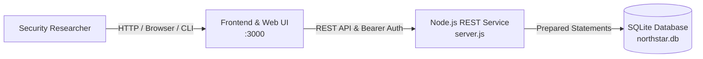

# Sayed Khashana — REST API IDOR CTF

[](https://github.com/Khashana22/Sayed-Khashana-REST-API-IDOR-CTF/actions/workflows/ci.yml)
[](LICENSE)
[-brightgreen.svg)](https://nodejs.org)
[](Dockerfile)
[](#security-concepts)

A deliberately vulnerable REST API security CTF designed to demonstrate **Insecure Direct Object Reference (IDOR)** / **Broken Object Level Authorization (BOLA)** through a realistic authenticated API workflow.

---

## 🎯 Overview

**Northstar Document Hub** simulates an enterprise internal portal utilized for storing proprietary project documents, release approvals, and internal communications. 

In this scenario, the security researcher is provided with credentials for a standard training analyst account (`alex.ward`). While authentication is enforced across the API surface, the application contains an object-level authorization flaw allowing access to confidential records across user boundaries.

> ⚠️ **Notice:** This project is intentionally vulnerable and is designed solely for authorized educational laboratories, CTF training, and security research.

---

## 🔍 Challenge Information

| Attribute | Specification |
| :--- | :--- |
| **Category** | Web & API Security |
| **Vulnerability Class** | Insecure Direct Object Reference (IDOR) / Broken Object Level Authorization (BOLA) |
| **OWASP Alignment** | OWASP API Security Top 10: API1:2023 (BOLA) / OWASP Top 10: A01:2021 (Broken Access Control) |
| **Difficulty** | Easy – Medium |
| **Estimated Solve Time** | 20 – 30 Minutes |
| **Technology Stack** | Node.js (v22+), SQLite (`node:sqlite`), Vanilla JS Frontend, Docker |
| **Authentication Model** | HMAC-SHA256 Signed Bearer Session Token |
| **Flag Format** | `SK-CTF{...}` |

---

## 🧠 Learning Objectives

- **API Attack-Surface Discovery:** Map and analyze authenticated endpoints and identify data structures.
- **Authentication vs. Authorization:** Recognize that establishing identity via valid session tokens does not inherently ensure permission to specific data objects.
- **Object-Level Authorization Analysis:** Inspect client-side and server-side authorization boundaries on individual resources.
- **Parameter & Identifier Manipulation:** Systematically manipulate direct object references to access unauthorized documents.
- **Multi-Stage API Exploitation:** Chain data gathered from compromised records to interact with downstream business processes.
- **Defensive API Engineering:** Understand secure architecture patterns, tenant isolation, and query-level ownership enforcement.

---

## 🏗️ Architecture

The lab is designed to be completely self-contained with zero external runtime dependencies, utilizing Node.js native standard library features and embedded SQLite storage.



### Components

- **Frontend (`public/`):** Lightweight client workspace providing document previews, company notices, and an interactive REST API activity inspector.
- **REST Service (`server.js`):** Lightweight HTTP REST service managing authentication, session issuance, document repositories, and review requests.
- **Data Persistence:** Automated database seeding via native Node SQLite (`node:sqlite`) on initialization.

---

## 🚀 Running the Lab

### Prerequisites

- **Option A (Containerized - Recommended):** [Docker Desktop](https://www.docker.com/) with Docker Compose v2.
- **Option B (Local Host):** [Node.js](https://nodejs.org/) version 22.0.0 or higher.

### Option A: Running with Docker Compose

1. Clone the repository:
   ```bash
   git clone https://github.com/Khashana22/Sayed-Khashana-REST-API-IDOR-CTF.git
   cd Sayed-Khashana-REST-API-IDOR-CTF
   ```

2. Build and start the container:
   ```bash
   docker compose up --build
   ```

3. Access the web interface at **`http://localhost:3000`**.

4. To stop the environment:
   ```bash
   docker compose down
   ```

5. To reset the environment and database:
   ```bash
   docker compose down -v
   ```

### Option B: Running Locally with Node.js

1. Ensure Node.js 22+ is installed:
   ```bash
   node -v
   ```

2. Start the server:
   ```bash
   npm start
   ```

3. Open **`http://localhost:3000`** in your browser or point your API client (Postman, Burp Suite, cURL) to port `3000`.

---

## 🔑 Initial Credentials

A training analyst account is provided for authenticating to the platform:

| Parameter | Value | Role |
| :--- | :--- | :--- |
| **Username** | `alex.ward` | Analyst |
| **Password** | `Maple!47` | Training Access |

---

## 🗺️ Challenge Flow (High-Level)

> 💡 *This overview outlines the methodology without spoiling the exact solution or revealing the flag.*

1. **Authentication:** Authenticate via `/api/auth/login` to obtain an analyst bearer token.
2. **Reconnaissance:** Inspect authorized projects and documents assigned to `alex.ward`. Use browser developer tools or an interception proxy to review JSON API requests.
3. **Information Gathering:** Examine company announcements and metadata for operational references.
4. **Boundary Testing:** Evaluate whether resource endpoints validate that the requesting user owns the requested entity or if ownership verification is missing.
5. **Downstream Interaction:** Leverage data disclosed across the authorization boundary to interface with operational receipt verification.

---

## 🔒 Security Concepts & Vulnerability Analysis

### Insecure Direct Object Reference (IDOR / BOLA)

An Insecure Direct Object Reference occurs when an application provides direct access to objects based on user-supplied input without performing adequate access control checks.

In a REST API context, this is frequently classified as **Broken Object Level Authorization (BOLA)**:

- **Authentication Check:** The server validates that the incoming `Authorization: Bearer <token>` header contains a valid, unexpired signature for an authenticated user.
- **Missing Authorization Check:** The server fetches a record directly by identifier (e.g., `/api/documents/:id`) without validating whether `document.ownerId === currentUser.id`.
- **Root Cause:** Relying on client-side UI filtering or implicit trust in request identifiers rather than enforcing strict server-side authorization boundaries.

---

## 🛡️ Defensive Perspective & Remediation

To remediate Insecure Direct Object References in RESTful architectures, implement the following security controls:

### 1. Enforce Query-Level Ownership Checks
Never query objects by arbitrary primary keys alone. Ensure the authenticated subject identity is bound directly into the data query:

```sql
-- Vulnerable:
SELECT * FROM documents WHERE id = ?;

-- Secure:
SELECT * FROM documents WHERE id = ? AND owner_id = ?;
```

### 2. Return Uniform Error Codes (Deny-by-Default)
Avoid leaking whether an unauthorized record exists. Return an identical `404 Not Found` response whether an object does not exist or belongs to another user:

```javascript
const document = db.documents.find(d => d.id === req.params.id && d.ownerId === user.id);
if (!document) {
  return send(res, 404, { error: "Document not found" });
}
```

### 3. Implement Centralized Policy Middleware
Enforce access control policies uniformly across routing layers rather than relying on individual endpoint developers to remember ownership checks.

---

## 🧪 Testing & Validation

The repository includes automated validation and integrity suites:

```bash
# Execute functional test suite (validates auth, normal flows, IDOR reproduction, and flag logic)
npm test

# Execute challenge integrity audit (verifies flag is not leaked in source, containers, or assets)
npm run audit
```

Both tests execute in CI via GitHub Actions on every push and pull request.

---

## 📜 Rules & Scope

- Testing is confined exclusively to the local instance running on `localhost:3000`.
- Do not attack or probe any third-party infrastructure.
- The challenge is intended to be solved via the web application and its REST API. Do not extract the flag directly from the SQLite database file, environment variables, or local files.

---

## ⚖️ Responsible Use

This software is provided for educational and authorized training purposes only. It must not be deployed on public production networks or used against unauthorized systems. Testing security concepts on systems without explicit prior permission is illegal.

---

## 👤 Author

**Sayed Khashana**  
*Web Application Penetration Tester | API Security Specialist*  
GitHub: [@Khashana22](https://github.com/Khashana22)

---

## 📄 License

This project is licensed under the [MIT License](LICENSE).
